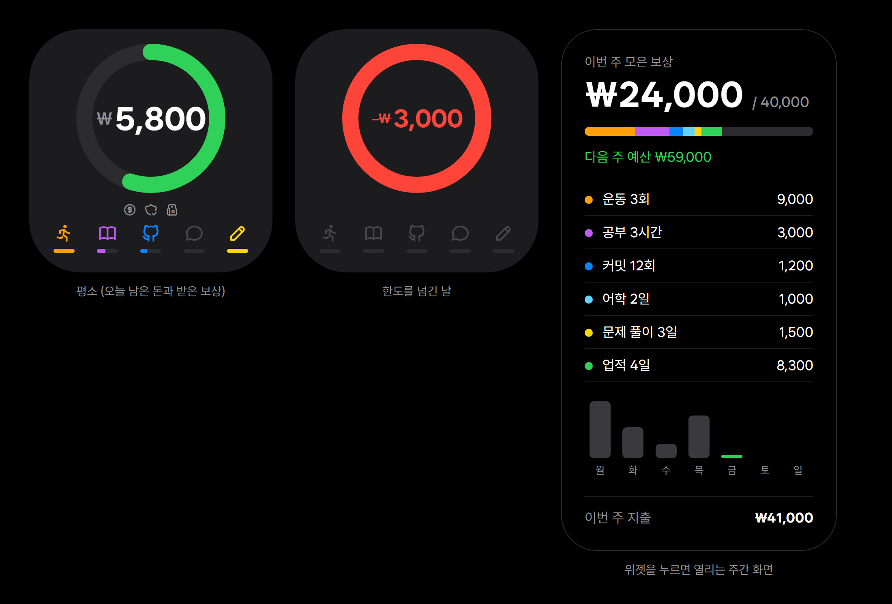

# Uh Money

통장에 돈이 있으니까 계속 써도 된다고 느끼는 걸 끊기 위한 개인용 소비 통제 도구입니다.
가계부처럼 기록하는 앱이 아니라, **실제 결제 알림을 자동으로 받아서 "지금 얼마까지 써도 되는지"를 아이폰 위젯 하나로 보여줍니다.**

<p align="center">
  
</p>

> 이미지의 금액과 기록은 모두 설명용 예시입니다.

## 핵심 아이디어

돈을 두 개로 나눠서 생각합니다.

| | 의미 |
|---|---|
| 실제 금융 상태 | 은행 계좌의 잔액과 거래 (현실의 돈) |
| 소비 허용량 | 내가 정한 규칙으로 계산한 "이번 주에 써도 되는 돈" |

둘은 절대 하나의 잔액으로 합치지 않습니다. 생활비 전용 계좌의 잔액을 **허용량에 맞춰 두는 방식**이라, 허용량을 넘기면 결제 자체가 거절됩니다.

## 규칙

- 기본 예산은 매주 **월요일에 새로 시작**합니다. 남은 돈은 다음 주로 넘어가지 않고 저축으로 확정됩니다.
- 하루 금액은 **이번 주 남은 돈 ÷ 남은 날수**입니다. 덜 쓰면 다음 날 금액이 늘어납니다.
- **갓생 보상**을 받으면 다음 주 예산이 늘어납니다. 주간 보상에는 상한이 있어서 다음 주 예산은 정해진 최대치를 넘지 않습니다.
- 하루와 한 주는 오전 6시에 바뀝니다. 새벽까지 깨어 있어도 "그날"로 칩니다.

### 보상

보상은 두 종류입니다. 금액과 상한은 [`server/src/engine/rules.ts`](server/src/engine/rules.ts) 한 곳에서 바꿉니다.

| 종류 | 항목 | 판정 방법 |
|---|---|---|
| 매일 보상 (하루 합계 상한) | 운동 | 운동 인증 앱 |
| | 공부 | 아이폰 집중 모드를 켠 시간 |
| | 커밋 | GitHub 커밋 수 |
| | 어학 앱 | 앱을 켜 둔 시간 |
| | 문제 풀이 | 풀이 앱의 업로드 기록 |
| 업적 (상한 예외) | 무지출 | 하루 지출이 0원 |
| | 한도 지키기 | 하루가 끝났을 때 오늘 쓸 돈이 0원 이상 |
| | 배달 안 시키기 | 배달 결제가 없음 |
| | 제시간 출석 | 위치 도착 시각 |

## 전체 구조

```text
 안드로이드 공기계                    Cloudflare Workers + D1                  아이폰
┌──────────────────┐   HTTPS    ┌──────────────────────────────┐   HTTPS   ┌──────────────┐
│ 은행 앱 푸시 알림  │ ─────────▶ │ 알림 파싱 → 중복 제거 → 분류   │ ◀──────── │ Scriptable   │
│ 읽기 (수집기 앱)   │            │ 한도·보상 계산 (순수 함수)     │           │ 위젯         │
└──────────────────┘            │ 주간 마감, 정산 안내           │           │ 단축어 자동화 │
                                 └───────▲───────▲───────▲──────┘           └──────────────┘
                              매시간 가져옴 │       │       │
                                 GitHub    운동 앱  풀이 앱
```

- **수집기** (`collector/`): 안드로이드의 알림 접근 기능으로 은행 앱 알림을 읽어 서버로 보냅니다. 전송에 실패하면 파일에 쌓아 두었다가 다시 보냅니다.
- **서버** (`server/`): 알림을 파싱하고, 같은 알림이 여러 번 와도 한 번만 반영하고, 잔액이 안 맞으면 놓친 거래를 찾아냅니다. 계산은 서버 한 곳에서만 합니다.
- **위젯** (`widget/`): 서버가 계산한 결과를 받아 그리기만 합니다.

### 왜 이런 구조인가

한국에서 개인이 실제 거래내역을 자동으로 받을 길은 거의 막혀 있습니다.

| 방법 | 개인 사용 가능? |
|---|---|
| 금융결제원 오픈뱅킹 | 테스트 환경만 가능, 실제 데이터는 사업자 필요 |
| 마이데이터 | 금융당국 허가 필요 |
| 카드·은행 앱 푸시 알림 | iOS는 다른 앱의 알림을 읽을 수 없음 |
| **안드로이드 공기계로 알림 읽기** | **가능 (이 프로젝트가 쓰는 방법)** |

그래서 남는 안드로이드 기기를 집에 두고 와이파이에 연결해 알림만 읽게 했습니다.

## 폴더

```text
collector/   안드로이드 수집기 앱 (Kotlin)
server/      Cloudflare Worker + D1 (TypeScript)
  src/engine/    규칙, 시간 계산, 보상, 업적, 한도 계산
  src/ingest/    알림 파서, 거래 분류, 잔액 검증
  migrations/    D1 스키마
widget/      Scriptable 위젯 스크립트
design/      위젯 디자인 시안
```

## 직접 돌려 보려면

필요한 것: Node.js, Cloudflare 계정(무료), 안드로이드 기기 1대, 아이폰.

### 서버

```bash
cd server
npm install
npm test                          # 규칙과 파서 테스트
npx wrangler d1 create uh-money   # 출력된 database_id를 wrangler.toml에 넣기
npm run db:migrate
npx wrangler deploy
```

비밀값은 코드에 넣지 않고 `wrangler secret put`으로 등록합니다.

| 이름 | 용도 |
|---|---|
| `COLLECTOR_TOKEN` | 수집기용 인증 토큰 |
| `PHONE_TOKEN` | 아이폰용 인증 토큰 |
| `OWNER_NAMES` | 내 계좌 간 이동을 지출에서 빼기 위한 본인 이름 |
| `KBANK_ACCOUNT`, `SALARY_ACCOUNT` | 주간 채우기 송금 링크 |
| `GITHUB_TOKEN` | 커밋 집계 (읽기 전용) |
| 그 외 연동 설정 | 운동 앱, 풀이 앱, 시간표 등 (선택) |

### 수집기

`collector/`를 Android Studio로 열어 빌드한 뒤 기기에 설치합니다. 토큰은 앱에 넣지 않고 설치할 때 `adb`로 전달합니다.

```bash
adb shell am start -n money.uh.collector/.MainActivity --es token <COLLECTOR_TOKEN>
```

앱 화면에서 **알림 접근 허용**과 **배터리 최적화 제외**를 켭니다.

### 위젯

아이폰에 Scriptable을 설치하고 [`widget/loader.js`](widget/loader.js)를 새 스크립트로 붙여 넣습니다. 처음 실행할 때 `PHONE_TOKEN`을 입력하면 iOS 키체인에 저장됩니다. 로더가 실행할 때마다 최신 위젯 코드를 받아 옵니다.

## 만들면서 정한 것들

- **계산은 서버에서, 표시는 위젯에서.** 규칙이 바뀌어도 서버만 고치면 됩니다.
- **계산은 순수 함수.** 같은 입력이면 항상 같은 결과라서 테스트로 규칙을 고정했습니다.
- **원본은 고치지 않고 쌓기만.** 알림 원문을 그대로 저장하고, 형식을 모르는 알림은 버리지 않고 "확인 필요"로 남깁니다.
- **빠뜨리는 것보다 더 세는 쪽으로.** 잔액이 예상보다 더 줄어 있으면 놓친 지출로 계산합니다.
- **비밀값은 코드 밖에.** 토큰, 계좌번호, 이름은 전부 Cloudflare 비밀 저장소에만 있습니다.

## 한계

- 안드로이드 기기를 항상 켜 두고 와이파이에 연결해야 합니다.
- 은행 앱의 알림 문구가 바뀌면 파서를 고쳐야 합니다. 형식을 모르는 알림은 저장만 하고 계산에서는 빼 둡니다.
- 아이폰 위젯 갱신 시점은 iOS가 정해서 몇 분 늦을 수 있습니다.
- 결제 자체를 막는 것은 "계좌 잔액을 허용량에 맞춰 두는" 방식이라, 주 단위로만 막힙니다.
